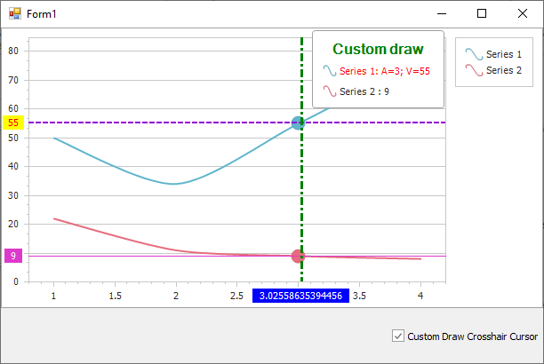

<!-- default badges list -->

<!-- default badges end -->

# Chart for WinForms - How to Custom Draw a Crosshair Cursor

This example shows how to use the [ChartControl.CustomDrawCrosshair](https://docs.devexpress.com/WindowsForms/DevExpress.XtraCharts.ChartControl.CustomDrawCrosshair) event to create a custom appearance for the crosshair cursor. This event is invoked when you select the **Custom Draw Crosshair Cursor** check box.

If you wish to display crosshair axis lines and labels on a chart before custom drawing the crosshair cursor, set the [CrosshairOptions.ShowArgumentLine](https://docs.devexpress.com/CoreLibraries/DevExpress.XtraCharts.CrosshairOptions.ShowArgumentLine), [CrosshairOptions.ShowArgumentLabels](https://docs.devexpress.com/CoreLibraries/DevExpress.XtraCharts.CrosshairOptions.ShowValueLabels), and [CrosshairOptions.ShowValueLine](https://docs.devexpress.com/CoreLibraries/DevExpress.XtraCharts.CrosshairOptions.ShowValueLine) properties to  `true`. 

## Files to Review

[Form1.cs](./CS/CustomDrawCrosshairCursor/Form1.cs) (VB: [Form1.vb](./VB/CustomDrawCrosshairCursor/Form1.vb))

## Documentation 

[Crosshair Cursor](https://docs.devexpress.com/WindowsForms/14710/controls-and-libraries/chart-control/end-user-features/tooltip-and-crosshair-cursor/crosshair-cursor?p=netframework)
